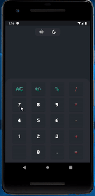
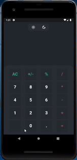

# Calculator

Project done during Raro Academy course, as the second assignment (LevelUP2)

## About the application

This project consist of a standard calculator.

### Functionalities

- Addition
- Subtraction
- Division
- Multiplication
- AC 
    - On press: erases the last digit
    - On long press: clears everything that were typed

- Gesture Detector on display that when user swipe erases the last digit

### Still not implemented

- Change signal (+/-)
- Percentage (%)
- Undo (Button without icon)
- Dark/ Light mode

### Bugs
Some bugs that are known to be happening:
- Addition of multiple minus signal
- Addition of multiple dots in the same number
- Acceptance of other operations after the minus signal is added to indicate negative number
    - Example: 
        - the value "12--10" is acceptable, but if you type a multiplication sign after the second minus, it will result in the string "12-*10", which is not acceptable.
- Calculation are done, without consider operations priority
## To Do
- [ ] Fix bugs reported
- [ ] Implement missing functionalities
- [ ] Test in different size screens
- [ ] Test in iOs devices

## Extra Information
- The layout was done by [Lucia Scott](https://dribbble.com/luciascott), and it available at [Dribbble](https://dribbble.com/shots/14709020-Calculator/attachments/6408579?mode=media), but some minor changes were made.